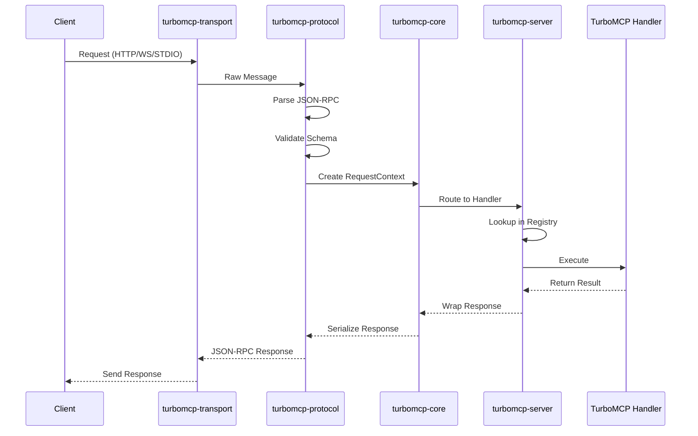

# TurboMCP Architecture

This document explains the modular architecture of **TurboMCP**, a high-performance Rust SDK for the Model Context Protocol (MCP).

## Overview

TurboMCP is built as a **layered architecture** with clear separation between foundational infrastructure and ergonomic developer APIs. This design enables both rapid prototyping and production-grade performance optimization.

```
┌─────────────────────────────────────────────────────────────┐
│                      TurboMCP Framework                     │
│              Ergonomic APIs & Developer Experience         │
└─────────────────────────────────────────────────────────────┘
┌─────────────────────────────────────────────────────────────┐
│                   Infrastructure Layer                     │
│          Server • Client • Transport • Protocol            │
└─────────────────────────────────────────────────────────────┘
┌─────────────────────────────────────────────────────────────┐
│                     Foundation Layer                       │
│             Core Types • Messages • State                  │
└─────────────────────────────────────────────────────────────┘
```

## Core Infrastructure

The foundation consists of focused crates that provide robust, low-level functionality:

### [`turbomcp-core`](./crates/turbomcp-core/) - Foundation Layer

**Purpose:** Core abstractions and performance-critical types

```
Responsibilities:
├── SIMD-accelerated message processing
├── Request/Response context management  
├── Rich error handling with context
├── Session state management
├── Component registry system
└── Zero-copy optimization utilities
```

**Key Features:**
- 🚀 **SIMD JSON Processing** - 2-3x faster than `serde_json` with `simd-json`
- 📦 **Zero-Copy Messages** - Memory-efficient processing with `Bytes`
- 🧵 **Thread-Safe State** - Concurrent session and request management
- 🎯 **Rich Error Context** - Structured error handling with `thiserror`
- 📊 **Observability Hooks** - Built-in metrics and tracing integration

### [`turbomcp-protocol`](./crates/turbomcp-protocol/) - Protocol Implementation

**Purpose:** MCP specification compliance and message format handling

```
Responsibilities:
├── JSON-RPC 2.0 message format
├── MCP protocol version 2025-06-18
├── Capability negotiation
├── JSON Schema validation
├── Type definitions for all MCP types
└── Protocol version management
```

**Key Features:**
- 📋 **Complete MCP Support** - Full implementation of MCP 2025-06-18 specification
- 🔧 **JSON-RPC 2.0** - Compliant request/response/notification handling
- ✅ **Schema Validation** - Runtime validation with `jsonschema` crate
- 🤝 **Capability Negotiation** - Automatic feature detection and negotiation
- 📝 **Rich Type System** - Rust types for all protocol messages

### [`turbomcp-transport`](./crates/turbomcp-transport/) - Transport Layer

**Purpose:** Network communication and connection management

```
Responsibilities:
├── Multi-protocol transport support
├── Connection pooling & management
├── Security & authentication
├── Compression & optimization  
├── Circuit breakers & reliability
└── TLS/SSL support
```

**Supported Transports:**
- 📟 **STDIO** - Standard input/output for local processes
- 🌐 **HTTP/SSE** - Server-Sent Events for web applications
- 🔌 **WebSocket** - Real-time bidirectional communication
- 🖧 **TCP** - Network socket communication
- 🔗 **Unix Sockets** - Local inter-process communication

**Security Features:**
- 🔒 **Enterprise Security** - CORS, CSP, security headers, rate limiting
- 🔑 **Authentication** - JWT validation, API key authentication
- 🔐 **TLS Support** - Modern TLS with `rustls`
- 🛡️ **Circuit Breakers** - Fault tolerance and reliability

### [`turbomcp-server`](./crates/turbomcp-server/) - Server Framework

**Purpose:** HTTP server implementation and request processing

```
Responsibilities:
├── Handler registry & routing
├── Middleware stack processing
├── OAuth 2.0 authentication
├── Health checks & metrics
├── Graceful shutdown handling
└── Production middleware
```

**Key Features:**
- 🗂️ **Handler Registry** - Type-safe handler registration and discovery
- 🔀 **Request Routing** - Efficient method dispatch and parameter injection
- 🔐 **OAuth 2.0 Integration** - Google, GitHub, Microsoft provider support
- 📊 **Health & Metrics** - Built-in monitoring and observability
- 🛑 **Graceful Shutdown** - Clean resource cleanup and connection draining

### [`turbomcp-client`](./crates/turbomcp-client/) - Client Implementation

**Purpose:** MCP client functionality with connection management

```
Responsibilities:
├── Connection establishment & management
├── Request/response correlation
├── Error recovery & retry logic
├── Capability negotiation
├── Session lifecycle management
└── Transport abstraction
```

**Key Features:**
- 🔌 **Multi-Transport** - Works with all transport protocols
- 🔄 **Auto-Retry** - Configurable retry logic with exponential backoff
- 📞 **Request Correlation** - Automatic ID generation and response matching
- 🤝 **Capability Negotiation** - Automatic server capability discovery

### [`turbomcp-macros`](./crates/turbomcp-macros/) - Procedural Macros

**Purpose:** Developer ergonomics through compile-time code generation

```
Generated Code:
├── #[server] - Server trait implementation
├── #[tool] - Tool handler registration  
├── #[resource] - Resource handler registration
├── #[prompt] - Prompt handler registration
└── Schema generation & validation
```

**Key Features:**
- 🎯 **Zero Boilerplate** - Automatic handler registration and trait implementation
- 📋 **Schema Generation** - Compile-time JSON schema creation from Rust types
- ✅ **Type Safety** - Compile-time parameter validation and conversion
- 🔍 **IDE Support** - Full IntelliSense and error reporting

### [`turbomcp-cli`](./crates/turbomcp-cli/) - Command Line Tools

**Purpose:** Development and debugging utilities

```
Commands:
├── tools-list - List available server tools
├── tools-call - Execute tool with arguments
├── schema-export - Export JSON schemas  
├── server-test - Test server functionality
└── debug - Protocol debugging utilities
```

**Key Features:**
- 🧪 **Server Testing** - Comprehensive server validation and testing
- 📊 **Schema Export** - JSON schema extraction for documentation
- 🔧 **Debug Tools** - Protocol-level debugging and inspection
- 🌐 **Multi-Transport** - Works with all transport protocols

## TurboMCP Framework

The main [`turbomcp`](./crates/turbomcp/) crate provides the high-level, ergonomic API that most developers will use:

### Design Principles

- **🚀 Zero Boilerplate** - Minimal code required for maximum functionality
- **⚡ Performance First** - Built on optimized infrastructure layer
- **🔒 Type Safety** - Compile-time validation prevents runtime errors
- **🎯 Progressive Complexity** - Simple by default, powerful when needed

### Framework Components

#### 1. Ergonomic Server Definition
```rust
use turbomcp::prelude::*;

#[derive(Clone)]
struct Calculator;

#[server]
impl Calculator {
    #[tool("Add two numbers")]
    async fn add(&self, a: f64, b: f64) -> McpResult<f64> {
        Ok(a + b)
    }
}

// Compiles to full server implementation using turbomcp-server
```

#### 2. Automatic Schema Generation
```rust
#[tool("Process user data")]
async fn process_user(
    &self,
    #[description("User's email address")]
    email: String,
    #[description("User's age in years")]
    age: u8,
) -> McpResult<UserProfile> {
    // JSON schema automatically generated and validated
    Ok(UserProfile { email, age })
}
```

#### 3. Context Injection
```rust
#[tool("Tool with context")]
async fn context_tool(&self, ctx: Context, data: String) -> McpResult<String> {
    // Context provides:
    // - Request correlation ID
    // - User authentication info  
    // - Performance metrics
    // - Structured logging
    ctx.info("Processing request").await?;
    Ok(format!("Processed: {}", data))
}
```

#### 4. Transport Integration
```rust
#[tokio::main]
async fn main() -> Result<(), Box<dyn std::error::Error>> {
    let server = Calculator;
    
    // All transport methods available
    server.run_stdio().await?;                // STDIO
    // server.run_tcp("127.0.0.1:8080").await?;  // TCP
    // server.run_unix("/tmp/mcp.sock").await?;  // Unix
    
    Ok(())
}
```

## Data Flow Architecture



## Usage Patterns

### High-Level Ergonomic API (Recommended)

```rust
use turbomcp::prelude::*;

#[derive(Clone)]
struct MyServer;

#[server] 
impl MyServer {
    #[tool("Example tool")]
    async fn my_tool(&self, input: String) -> McpResult<String> {
        Ok(format!("Processed: {}", input))
    }
}

#[tokio::main]
async fn main() -> Result<(), Box<dyn std::error::Error>> {
    MyServer.run_stdio().await?;
    Ok(())
}
```

### Low-Level Infrastructure API (Advanced)

```rust
use turbomcp_server::{McpServer, HandlerRegistry};
use turbomcp_transport::stdio::StdioTransport;

#[tokio::main] 
async fn main() -> Result<(), Box<dyn std::error::Error>> {
    let mut server = McpServer::new();
    
    // Manual handler registration
    server.register_tool_handler("my_tool", |params| async {
        // Custom handler implementation
        Ok(serde_json::json!({"result": "processed"}))
    }).await?;
    
    // Manual transport setup
    server.serve(StdioTransport::new()).await?;
    Ok(())
}
```

## Performance Characteristics

### Benchmarks (vs Standard Libraries)

- **JSON Processing:** 2-3x faster than `serde_json` with SIMD acceleration
- **Memory Usage:** 40% reduction with zero-copy message handling
- **Concurrency:** Linear scaling with Tokio async runtime
- **Transport Overhead:** Sub-millisecond request routing

### Optimization Features

- 🚀 **SIMD Acceleration** - CPU-optimized JSON processing
- 📦 **Zero-Copy** - Minimal memory allocations and copies
- 🔄 **Connection Pooling** - Efficient connection reuse
- ⚡ **Circuit Breakers** - Prevent cascade failures
- 📊 **Efficient Routing** - O(1) handler lookup

## Crate Selection Guide

| Use Case | Recommended Approach | Crates Needed |
|----------|---------------------|---------------|
| **🚀 Quick Prototyping** | Use high-level framework | [`turbomcp`](./crates/turbomcp/) |
| **🏭 Production Application** | Framework + selective core crates | [`turbomcp`](./crates/turbomcp/) + [`turbomcp-transport`](./crates/turbomcp-transport/) |
| **🔧 Custom Transport** | Build on infrastructure | [`turbomcp-core`](./crates/turbomcp-core/) + [`turbomcp-protocol`](./crates/turbomcp-protocol/) + custom |
| **📚 Library Integration** | Use specific components | [`turbomcp-core`](./crates/turbomcp-core/) + needed layers |
| **⚡ Performance Critical** | Direct infrastructure usage | Core crates + manual optimization |
| **🧪 Testing & Development** | CLI tools | [`turbomcp-cli`](./crates/turbomcp-cli/) |

## Architecture Benefits

### 🏗️ **Modularity**
- **Composable Design** - Mix and match crates as needed
- **Clear Boundaries** - Well-defined responsibilities per crate
- **Custom Extensions** - Add custom transports, middleware, handlers

### 👨‍💻 **Developer Experience**  
- **Progressive Complexity** - Start simple, add complexity when needed
- **Type Safety** - Compile-time validation prevents runtime errors
- **Rich Tooling** - CLI tools, schema generation, debugging support

### 🚀 **Performance**
- **SIMD Optimization** - CPU-level acceleration for JSON processing
- **Zero-Copy Design** - Minimal memory allocations and copies
- **Efficient Networking** - Connection pooling and circuit breakers

### 🛡️ **Production Ready**
- **Enterprise Security** - OAuth 2.0, CORS, rate limiting, TLS
- **Observability** - Built-in metrics, tracing, health checks
- **Reliability** - Graceful shutdown, error recovery, fault tolerance

## Related Documentation

- **[Main README](./README.md)** - Getting started and overview
- **[Security Guide](./crates/turbomcp-transport/SECURITY_FEATURES.md)** - Enterprise security features
- **[API Documentation](https://docs.rs/turbomcp)** - Complete API reference
- **[Contributing Guide](./CONTRIBUTING.md)** - How to contribute to TurboMCP