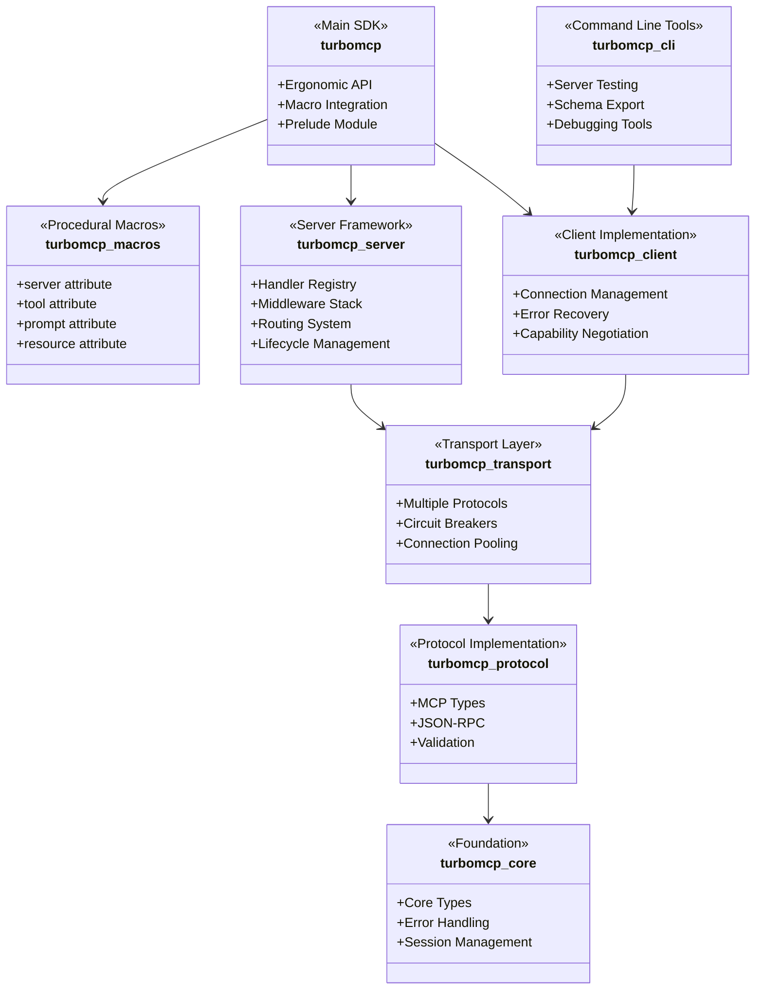

# TurboMCP Crates

This directory contains the individual crates that make up the TurboMCP framework. Each crate is designed with a specific responsibility and can be used independently or as part of the complete framework.

## Architecture Overview



## Crates

### [`turbomcp`](./turbomcp/) - Main SDK
[](https://docs.rs/turbomcp)

The main SDK crate providing ergonomic APIs and integration. This is what most users will interact with directly.

**Key Features:**
- Procedural macro integration
- Prelude module with common imports
- High-level server and client APIs
- Performance optimizations and SIMD support

### [`turbomcp-core`](./turbomcp-core/) - Foundation
[](https://docs.rs/turbomcp-core)

Foundation crate providing core types, error handling, and utilities used by all other crates.

**Key Features:**
- SIMD-accelerated JSON processing
- Zero-copy message handling with `Bytes`
- Comprehensive error handling with rich context
- Session management with LRU eviction
- Request/response context tracking

### [`turbomcp-protocol`](./turbomcp-protocol/) - Protocol Implementation
[](https://docs.rs/turbomcp-protocol)

Complete implementation of the Model Context Protocol specification with JSON-RPC support.

**Key Features:**
- MCP 2025-06-18 specification compliance
- JSON-RPC 2.0 with batching support
- Type-safe capability negotiation
- Protocol version management
- Comprehensive validation

### [`turbomcp-transport`](./turbomcp-transport/) - Transport Layer
[](https://docs.rs/turbomcp-transport)

Multi-protocol transport layer with fault tolerance and reliability features.

**Key Features:**
- Multiple transport protocols (HTTP/SSE, WebSocket, TCP, Unix sockets, STDIO)
- Circuit breakers and retry logic with exponential backoff
- Connection pooling with configurable limits
- Health monitoring and graceful degradation
- Message compression support

### [`turbomcp-server`](./turbomcp-server/) - Server Framework
[](https://docs.rs/turbomcp-server)

MCP server implementation with middleware support, routing, and lifecycle management.

**Key Features:**
- Handler registry with type-safe registration
- OAuth 2.0 authentication with Google, GitHub, Microsoft providers
- Middleware stack for PKCE security, rate limiting, security headers
- Request routing and lifecycle management
- Health checks and graceful shutdown
- Performance metrics and monitoring

### [`turbomcp-client`](./turbomcp-client/) - Client Implementation
[](https://docs.rs/turbomcp-client)

MCP client implementation with connection management and error recovery.

**Key Features:**
- Connection management with automatic reconnection
- Error handling and recovery mechanisms
- Support for all MCP capabilities
- Transport-agnostic design
- Type-safe protocol communication

### [`turbomcp-macros`](./turbomcp-macros/) - Procedural Macros
[](https://docs.rs/turbomcp-macros)

Procedural macros for ergonomic MCP server development.

**Key Features:**
- `#[server]` - Convert structs into MCP servers
- `#[tool]` - Mark methods as tool handlers with automatic schema generation
- `#[prompt]` - Mark methods as prompt handlers
- `#[resource]` - Mark methods as resource handlers with URI templates
- Automatic JSON schema generation

### [`turbomcp-cli`](./turbomcp-cli/) - Command Line Tools
[](https://docs.rs/turbomcp-cli)

Command-line interface for interacting with MCP servers, testing, and debugging.

**Key Features:**
- Connect to servers via multiple transports
- List available tools and call them with arguments
- Export tool schemas for documentation
- Server testing and validation
- OAuth 2.0 client authentication support

## Usage Patterns

### Complete Framework (Recommended)
```toml
[dependencies]
turbomcp = "1.0"
```

### Specific Layers Only
```toml
[dependencies]
# For building custom servers
turbomcp-server = "1.0"
turbomcp-transport = "1.0"

# For building custom clients  
turbomcp-client = "1.0"
turbomcp-protocol = "1.0"

# For low-level protocol work
turbomcp-protocol = "1.0"
turbomcp-core = "1.0"
```

### Development Tools
```bash
# Install CLI tools
cargo install --path turbomcp-cli

# Use for testing HTTP servers
turbomcp-cli tools-list --url http://localhost:8080/mcp

# Use for testing STDIO servers
turbomcp-cli tools-list --command "./my-server"
```

## Documentation

Each crate has its own README.md with detailed usage examples and API documentation. The main documentation is available at:

- [API Documentation](https://docs.rs/turbomcp) - Complete API reference
- [Architecture Guide](../ARCHITECTURE.md) - System design and component interaction  
- [MCP Specification](https://modelcontextprotocol.io) - Official protocol documentation

## Contributing

When contributing to specific crates:

1. **Core changes** → [`turbomcp-core`](./turbomcp-core/)
2. **Protocol updates** → [`turbomcp-protocol`](./turbomcp-protocol/)  
3. **Transport features** → [`turbomcp-transport`](./turbomcp-transport/)
4. **Server features** → [`turbomcp-server`](./turbomcp-server/)
5. **Client features** → [`turbomcp-client`](./turbomcp-client/)
6. **Macro improvements** → [`turbomcp-macros`](./turbomcp-macros/)
7. **CLI features** → [`turbomcp-cli`](./turbomcp-cli/)
8. **Integration work** → [`turbomcp`](./turbomcp/)

See the main [CONTRIBUTING.md](../CONTRIBUTING.md) for general contribution guidelines.