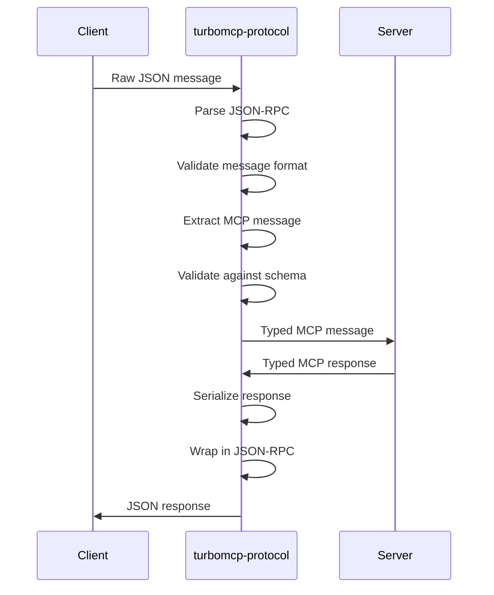

# TurboMCP Protocol

[](https://crates.io/crates/turbomcp-protocol)
[](https://docs.rs/turbomcp-protocol)
[](https://opensource.org/licenses/MIT)

**Complete Model Context Protocol (MCP) specification implementation with JSON-RPC 2.0 and runtime schema validation.**

## Overview

`turbomcp-protocol` provides a complete, specification-compliant implementation of the Model Context Protocol (MCP) version 2025-06-18. This crate handles all protocol-level concerns including message formatting, capability negotiation, and runtime validation.

## Key Features

### 📋 **Complete MCP Specification Support**
- **MCP 2025-06-18** - Full implementation of the latest protocol specification
- **All message types** - Tools, resources, prompts, and capabilities
- **Capability negotiation** - Automatic feature detection and handshake
- **Version compatibility** - Forward and backward compatibility support

### 🔧 **JSON-RPC 2.0 Implementation**
- **Compliant message format** - Request, response, and notification handling
- **ID correlation** - Automatic request/response correlation
- **Error handling** - Standard JSON-RPC error codes and extensions
- **Batch processing** - Support for batch request/response operations

### ✅ **Runtime Schema Validation**
- **JSON Schema validation** - Runtime validation using `jsonschema` crate
- **Type safety** - Rust type definitions for all MCP message types
- **Parameter validation** - Tool and resource parameter validation
- **Schema generation** - Automatic schema generation from Rust types

### 🤝 **Capability Management**
- **Server capabilities** - Tools, resources, prompts declarations
- **Client capabilities** - Sampling, roots, progress reporting
- **Feature negotiation** - Automatic capability matching
- **Extension support** - Custom capability extensions

## Architecture

```
┌─────────────────────────────────────────────┐
│            TurboMCP Protocol                │
├─────────────────────────────────────────────┤
│ MCP Message Types                          │
│ ├── InitializeRequest/Response             │
│ ├── Tool/Resource/Prompt messages          │
│ ├── Capability negotiation               │
│ └── Notification handling                 │
├─────────────────────────────────────────────┤
│ JSON-RPC 2.0 Layer                        │
│ ├── Request/Response correlation          │
│ ├── ID generation and tracking           │
│ ├── Error code standardization           │
│ └── Batch message processing             │
├─────────────────────────────────────────────┤
│ Schema Validation                          │
│ ├── Runtime JSON schema validation       │
│ ├── Parameter type checking              │
│ ├── Response format validation           │
│ └── Custom schema extension support      │
└─────────────────────────────────────────────┘
```

## MCP Message Types

### Core Message Types

```rust
use turbomcp_protocol::{
    InitializeRequest, InitializeResponse,
    ToolsListRequest, ToolsListResponse,
    ToolsCallRequest, ToolsCallResponse,
    ResourcesListRequest, ResourcesListResponse,
    ResourcesReadRequest, ResourcesReadResponse,
    PromptsListRequest, PromptsListResponse,
    PromptsGetRequest, PromptsGetResponse,
};
```

### JSON-RPC Infrastructure

```rust
use turbomcp_protocol::{
    JsonRpcRequest, JsonRpcResponse, JsonRpcNotification,
    JsonRpcError, ErrorCode, RequestId,
};
```

## Usage

### Basic Protocol Handling

```rust
use turbomcp_protocol::{
    JsonRpcRequest, JsonRpcResponse, InitializeRequest, 
    ToolsListRequest, McpError
};

// Parse incoming JSON-RPC request
let json_data = r#"{
    "jsonrpc": "2.0",
    "id": 1,
    "method": "initialize",
    "params": {
        "protocolVersion": "2025-06-18",
        "capabilities": {},
        "clientInfo": {"name": "test-client", "version": "1.0.0"}
    }
}"#;

let request: JsonRpcRequest = serde_json::from_str(json_data)?;

// Handle specific message types
match request.method.as_str() {
    "initialize" => {
        let init_req: InitializeRequest = serde_json::from_value(request.params)?;
        // Process initialization
    },
    "tools/list" => {
        let tools_req: ToolsListRequest = serde_json::from_value(request.params)?;
        // Process tools list request
    },
    _ => {
        // Handle unknown method
    }
}
```

### Schema Validation

```rust
use turbomcp_protocol::{validate_tool_call, ToolCallParams, ValidationResult};

// Define tool parameters with schema validation
#[derive(serde::Serialize, serde::Deserialize)]
struct AddParams {
    a: f64,
    b: f64,
}

// Validate tool call parameters
let params = serde_json::json!({"a": 5.0, "b": 3.0});
let result: ValidationResult = validate_tool_call("add", &params)?;

match result {
    ValidationResult::Valid => {
        // Parameters are valid, proceed with tool call
        let add_params: AddParams = serde_json::from_value(params)?;
    },
    ValidationResult::Invalid(errors) => {
        // Handle validation errors
        for error in errors {
            eprintln!("Validation error: {}", error);
        }
    }
}
```

### Capability Negotiation

```rust
use turbomcp_protocol::{
    ServerCapabilities, ClientCapabilities, CapabilitySet,
    ToolCapability, ResourceCapability, PromptCapability
};

// Define server capabilities
let server_caps = ServerCapabilities {
    tools: Some(ToolCapability {}),
    resources: Some(ResourceCapability { 
        subscribe: true,
        list_changed: true 
    }),
    prompts: Some(PromptCapability {}),
    experimental: None,
};

// Define client capabilities  
let client_caps = ClientCapabilities {
    sampling: None,
    roots: Some(RootCapability { 
        list_changed: true 
    }),
    experimental: None,
};

// Negotiate capabilities
let negotiated = negotiate_capabilities(&server_caps, &client_caps)?;
```

### Error Handling

```rust
use turbomcp_protocol::{JsonRpcError, ErrorCode, McpError};

// Create protocol-specific errors
fn handle_tool_error(error: &str) -> JsonRpcError {
    JsonRpcError {
        code: ErrorCode::InvalidParams,
        message: format!("Tool validation failed: {}", error),
        data: None,
    }
}

// Convert to MCP error
let mcp_error = McpError::Protocol(handle_tool_error("Missing parameter 'name'"));
```

### Custom Message Types

```rust
use turbomcp_protocol::{JsonRpcRequest, JsonRpcResponse, RequestId};
use serde::{Serialize, Deserialize};

// Define custom message types
#[derive(Serialize, Deserialize)]
struct CustomRequest {
    custom_field: String,
    optional_data: Option<serde_json::Value>,
}

#[derive(Serialize, Deserialize)]
struct CustomResponse {
    result: String,
    metadata: serde_json::Value,
}

// Create custom JSON-RPC messages
fn create_custom_request(id: RequestId, params: CustomRequest) -> JsonRpcRequest {
    JsonRpcRequest {
        jsonrpc: "2.0".to_string(),
        id,
        method: "custom/method".to_string(),
        params: serde_json::to_value(params).unwrap(),
    }
}
```

## Message Flow



## Feature Flags

| Feature | Description | Default |
|---------|-------------|---------|
| `validation` | Enable runtime schema validation | ✅ |
| `extensions` | Enable MCP extension message types | ❌ |
| `batch` | Enable JSON-RPC batch processing | ✅ |
| `async-validation` | Enable async schema validation | ❌ |

## Supported MCP Methods

### Core Methods

- `initialize` - Protocol initialization and capability negotiation
- `initialized` - Initialization completion notification

### Tool Methods

- `tools/list` - List available tools
- `tools/call` - Execute a tool with parameters

### Resource Methods

- `resources/list` - List available resources
- `resources/read` - Read resource content
- `resources/updated` - Resource change notification

### Prompt Methods

- `prompts/list` - List available prompts
- `prompts/get` - Get prompt content

### Capability Methods

- `capabilities/changed` - Capability change notification

## Integration

### With TurboMCP Framework

Protocol handling is automatic when using the main framework:

```rust
use turbomcp::prelude::*;

#[server]
impl MyServer {
    #[tool("Add numbers")]
    async fn add(&self, a: f64, b: f64) -> McpResult<f64> {
        // Protocol parsing and validation handled automatically
        Ok(a + b)
    }
}
```

### Direct Protocol Usage

For custom implementations or integrations:

```rust
use turbomcp_protocol::{McpServer, JsonRpcRequest, JsonRpcResponse};

struct CustomProtocolHandler;

impl CustomProtocolHandler {
    async fn handle_message(&self, raw_json: &str) -> Result<String, Box<dyn std::error::Error>> {
        // Parse JSON-RPC message
        let request: JsonRpcRequest = serde_json::from_str(raw_json)?;
        
        // Handle based on method
        let response = match request.method.as_str() {
            "tools/list" => self.handle_tools_list(request).await?,
            "tools/call" => self.handle_tools_call(request).await?,
            _ => return Err("Unknown method".into()),
        };
        
        // Serialize response
        Ok(serde_json::to_string(&response)?)
    }
}
```

## Development

### Building

```bash
# Build with all features
cargo build --features validation,extensions,batch

# Build minimal (no validation)
cargo build --no-default-features
```

### Testing

```bash
# Run protocol compliance tests
cargo test

# Test with all message types
cargo test --features extensions

# Validate against MCP specification
cargo test test_mcp_compliance
```

### Schema Validation

```bash
# Generate JSON schemas from Rust types
cargo run --example generate_schemas

# Validate example messages
cargo test test_message_validation
```

## Related Crates

- **[turbomcp](../turbomcp/)** - Main framework (uses this crate)
- **[turbomcp-core](../turbomcp-core/)** - Core types and utilities
- **[turbomcp-transport](../turbomcp-transport/)** - Transport layer
- **[turbomcp-server](../turbomcp-server/)** - Server framework

## External Resources

- **[MCP Specification](https://modelcontextprotocol.io/)** - Official protocol specification
- **[JSON-RPC 2.0](https://www.jsonrpc.org/specification)** - JSON-RPC specification
- **[JSON Schema](https://json-schema.org/)** - Schema validation specification

## License

Licensed under the [MIT License](../../LICENSE).

---

*Part of the [TurboMCP](../../) high-performance Rust SDK for the Model Context Protocol.*